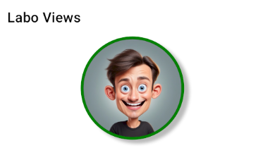
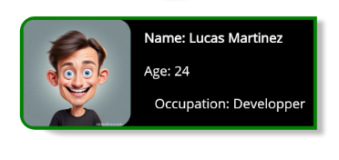
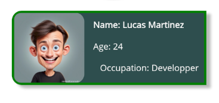
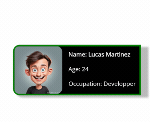

# Views - Border

- Gebruik de [documentatie](https://learn.microsoft.com/en-us/dotnet/maui/user-interface/controls/border) over borders om deze oefening te maken samen met de tutorial van James Montemagno op [YouTube](https://www.youtube.com/watch?v=x-kyAeAGFVg).
- Probeer een ronde profielfoto op te bouwen zoals getoond in de screenshot: 

	- De foto heeft een hoogte en breedte van 150
	- De dikte van de kader is 4 en hij is groen
	- De schaduw is *DarkGray* en staat naar rechtsonder 

(de getoonde afbeelding staat in de solution, gebruik eventueel een eigen foto of image)

- Maak nu een kaartje met info over een persoon: 

	- Het kaartje heeft een hoogte van 120
	- De hoeken hebben een afronding van 15
	- De naam van de persoon is vetjes gedrukt
	- Het kaartje heeft enkel aan de linkerkant een afronding (de foto rechts)
	- De schaduw is dezelfde als in de vorige opdracht
	- Voor de layout mag je zelf kiezen hoe je deze bouwt (Grid, Stacklayouts, Flexlayouts )

## Extra: tap gesture

Voeg op de `<Border>` van het kaartje een *tap gesture* toe, zoek op hoe je dit doet in de [documentatie](https://learn.microsoft.com/en-us/dotnet/maui/fundamentals/gestures/tap?view=net-maui-8.0).

Verander de achtergrondkleur van het kaartje naar *DarkSladeGray* als je er op duwt (en weer zwart als je er nog eens op duwt):

## Extra (fun): animations

Zoek op in de [documentatie van animations](https://learn.microsoft.com/en-us/dotnet/maui/user-interface/animation/basic?view=net-maui-8.0) hoe je iets rond zijn as laat draaien in .NET Maui. 

Bij het tappen op het kaartje: laat het een keer snel rond zijn as draaien: 

Kan je er voor zorgen dat dit bij elke klik lukt? 

# Views - Experimenten

Voeg nog enkele Views uit de slides toe aan deze applicatie en experimenteer met verschillende properties en hun waardes. 

